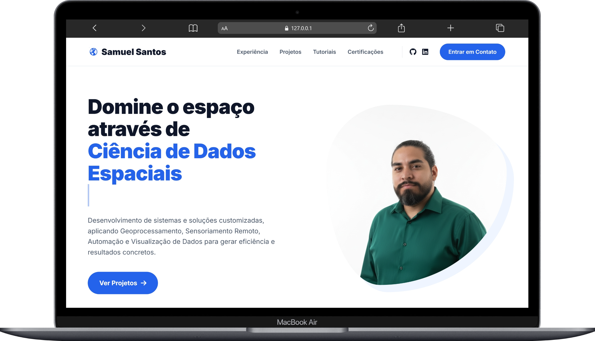

# Portfólio Profissional — Samuel Santos

Este repositório hospeda minha página de portfólio profissional, criada com HTML e CSS puro, e publicada via **GitHub Pages**.

Acesse a versão online e interativa em:

**https://samuel-c-santos.github.io/** ou **https://samuelsantos.site/**



---

## Sobre

Sou um profissional especializado em ciência de dados e geoprocessamento, com foco em soluções ambientais e análise espacial. Mestre em Biologia Ambiental e especialista em Ciência de Dados, desenvolvo desde análises exploratórias até sistemas completos de automação e visualização.

Neste portfólio, apresento:

- Projetos em Python, R, SQL, Flask e React Native
- Dashboards interativos no Power BI e Plotly/Dash
- Análises geoespaciais e processamento de imagens de satélite
- Sistemas de automação para certificação ambiental
- Aplicações de geoestatística e monitoramento territorial
- **Tutoriais técnicos** sobre QGIS, Python, Google Earth Engine e análise de dados

---

## Tecnologias Utilizadas no Portfólio

- HTML5 & CSS3
- GitHub Pages
- Google Fonts (Inter)
- Font Awesome (ícones)
- Visual Studio Code

---

## Destaques do Conteúdo

O portfólio apresenta seções organizadas que incluem:

- **Experiências Profissionais**: Trajetória e realizações
- **Projetos em Destaque**: Principais trabalhos desenvolvidos
- **Tutoriais**: Guias técnicos sobre geotecnologias e análise de dados
- **Certificações**: Credenciais profissionais da IBM, Google e outras instituições
- **Educação**: Formação acadêmica e especializações
- **Contato**: Canais de comunicação e redes profissionais

---

## Estrutura do Projeto

```
samuel-c-santos.github.io/
├── index.html                    # Estrutura da página
├── style.css                     # Estilos e responsividade
├── Perfil2.png                   # Foto de perfil
├── samuel_presentation.png       # Imagens do portfólio
└── README.md                     # Documentação
```

---

## Repositórios Relacionados

Confira também meus outros repositórios:

- **Tutoriais**: [samuelsantos.site/tutoriais](https://samuelsantos.site/tutoriais) — Biblioteca de tutoriais técnicos
- **Cartografia**: [github.com/samuel-c-santos/cartografia](https://github.com/samuel-c-santos/cartografia) — Portfólio de Geoprocessamento

---

## Contato

- E-mail: [samuelsantosambiental@gmail.com](mailto:samuelsantosambiental@gmail.com)
- LinkedIn: [linkedin.com/in/samuel-c-santos](https://www.linkedin.com/in/samuel-c-santos/)
- GitHub: [github.com/samuel-c-santos](https://github.com/samuel-c-santos)
- WhatsApp: [+55 91 98474-1391](https://wa.me/5591984741391)
- Cartão Digital: [dot.cards/samuelsantos](https://dot.cards/samuelsantos)

---

> Repositório desenvolvido para apresentação profissional e demonstração de projetos nas áreas de ciência de dados, análise espacial, automação de processos e regularização ambiental.
